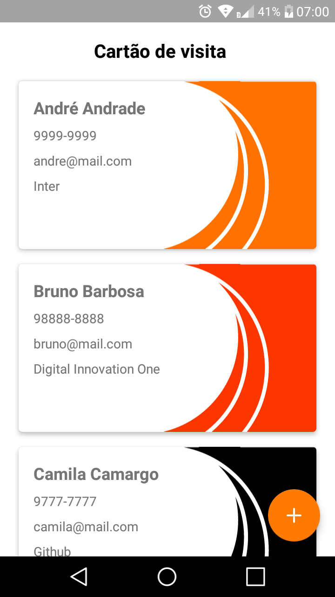
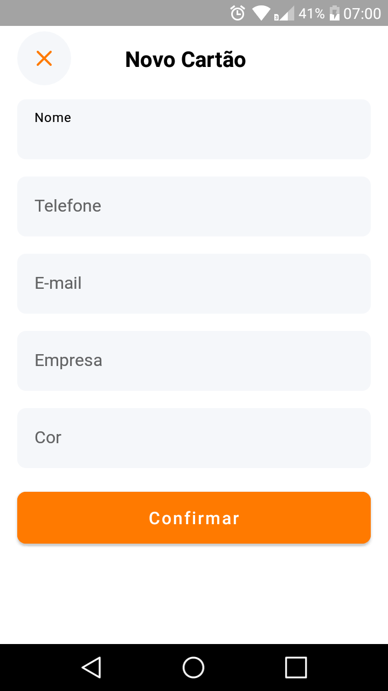

# Business Card - Bootcamp Inter Android Developer
Projeto 1 do bootcamp [Inter Android Developer](https://digitalinnovation.one/bootcamps/inter-android-developer?utm_source=lp-orbi-techboost&utm_medium=organic&utm_campaign=inter-android-developer) na [Digital Innovation One](https://digitalinnovation.one/)

  

### Funcionalidades e melhorias 
* Criar e compartilhar cartões de visitas
* Seletor de cores
* Novo ícone
* Novo design inspirado no app do Inter
* Novo design dos cartões de visita
* Verificação de campos vazios
* Confirmação para compartilhar cartão de visitas
* Formatação automática do número de telefone

### Tecnlogias
* [Room](https://developer.android.com/training/data-storage/room?hl=pt-br)
* [Componentes da arquitetura do Android](https://developer.android.com/topic/libraries/architecture?hl=pt-br)
* [Componentes do Material Design](https://material.io/components?platform=android)
* [Corrotinas](https://developer.android.com/kotlin/coroutines?hl=pt-br)
